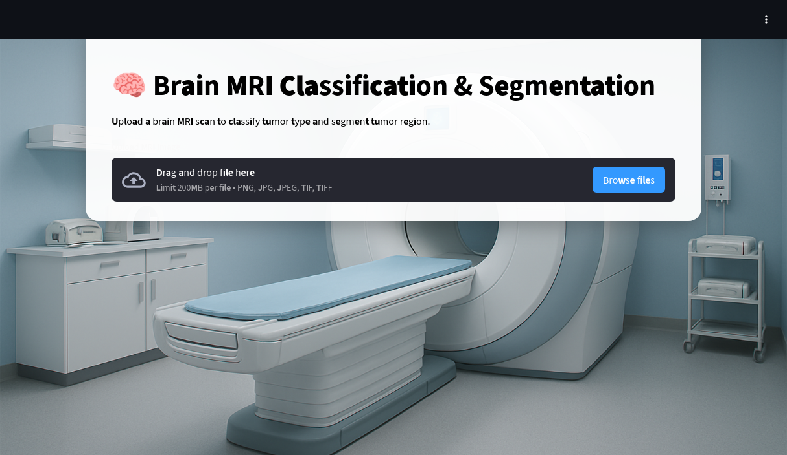

# Brain Tumor Segmentation & Classification with U-Net + CNN  

This project provides an **end-to-end medical imaging pipeline** for analyzing brain MRI scans. It uses:  

- **U-Net** for **tumor segmentation** (detecting and localizing tumors in MRI images).  
- **CNN classifier** for **tumor type classification** (e.g., glioma, meningioma, pituitary, etc.).  
- **Gemini API (Google GenAI)** to generate an **AI-assisted medical report** summarizing findings in natural language.  

---

## 🚀 Features  

- **Segmentation**: Pixel-level tumor detection using U-Net.  
- **Classification**: CNN model predicts tumor type from segmented regions.  
- **Medical Report Generation**: Automatically generates a clinician-style report from results using Gemini.  
- **Interactive App**: Streamlit-based interface for uploading MRIs, visualizing masks, classification results, and reports.  

